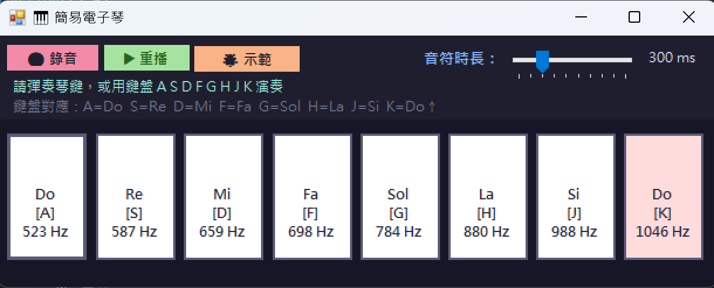
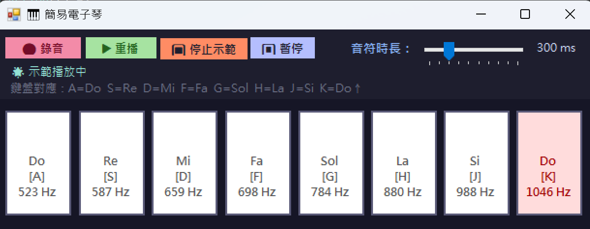

# 🎹 BeepPlayer — 簡易電子琴

一款以 Windows Forms 製作的輕量級電子琴應用程式，透過 Windows 內建的 `Beep` API 發出音效，不需要任何音效驅動或外部函式庫，開箱即用。



---

## ✨ 功能特色

| 功能 | 說明 |
|------|------|
| 🎹 **8 個琴鍵** | Do / Re / Mi / Fa / Sol / La / Si / Do↑，涵蓋完整 C 大調音階 |
| ⌨️ **鍵盤演奏** | 對應鍵盤 `A S D F G H J K`，無需滑鼠即可彈奏 |
| 🔴 **錄音** | 記錄每個音符與音符間隔，還原真實演奏節奏 |
| ▶ **重播** | 依照錄音時的時間間距完整重播，可隨時停止 |
| 🌟 **示範（小星星）** | 內建《小星星》旋律，可暫停 / 繼續 / 停止 |
| ⏸ **暫停 / 繼續** | 示範播放時可即時暫停，再次點擊繼續播放 |
| 🎚️ **音符時長調整** | TrackBar 滑桿可調整每個音符的發音長度（100 ms ～ 1000 ms） |
| 🖥️ **響應式視窗** | 拖曳縮放視窗時，琴鍵比例自動跟著調整 |
| 🎨 **深色主題** | 採用深藍紫色調，長時間使用不傷眼 |

---

## 📸 畫面截圖

**待機狀態**


**示範播放中**



---

## 🚀 系統需求

- **作業系統**：Windows 10 / 11
- **執行環境**：.NET Framework 4.7.2 或以上
- 無需安裝額外套件或音效驅動

---

## 🔧 建置與執行

1. 以 Visual Studio 2019 或更新版本開啟 `BeepPlayer.sln`
2. 選擇 **Debug** 或 **Release** 設定
3. 按下 **F5** 直接執行，或 **Ctrl+Shift+B** 先建置再執行

> 亦可直接執行 `bin\Debug\BeepPlayer.exe`，無需重新編譯。

---

## 🎮 操作說明

### 琴鍵對應

| 鍵盤按鍵 | 音符 | 頻率 |
|:--------:|:----:|-----:|
| `A` | Do | 523 Hz |
| `S` | Re | 587 Hz |
| `D` | Mi | 659 Hz |
| `F` | Fa | 698 Hz |
| `G` | Sol | 784 Hz |
| `H` | La | 880 Hz |
| `J` | Si | 988 Hz |
| `K` | Do↑ | 1046 Hz |

### 錄音與重播

1. 點擊「🔴 錄音」開始錄製，此時鍵盤與琴鍵皆可使用
2. 彈奏完畢後再次點擊「⏹ 停止錄音」
3. 點擊「▶ 重播」即可依照原始節奏完整重播
4. 重播途中點擊「⏹ 停止重播」可立即中止

### 示範播放

1. 點擊「🌟 示範」自動播放《小星星》旋律
2. 播放中可點擊「⏸ 暫停」暫時停止，再點一次「▶ 繼續」恢復
3. 任何時刻點擊「⏹ 停止示範」中止播放

---

## 📁 專案結構

```
BeepPlayer/
├── BeepPlayer.sln
├── BeepPlayer/
│   ├── frmBeepPlayer.cs          # 主視窗邏輯
│   ├── frmBeepPlayer.Designer.cs # UI 配置定義
│   ├── frmBeepPlayer.resx        # 資源檔
│   ├── Program.cs                # 程式進入點
│   └── Properties/
├── Images/
│   ├── sample.png                # 待機畫面截圖
│   └── sample1.png               # 示範播放截圖
├── LICENSE.txt
└── README.md
```

---

## 📄 授權

本專案採用 [MIT License](LICENSE.txt) 授權。

Copyright (c) 2026 YENCHUN-YIN
